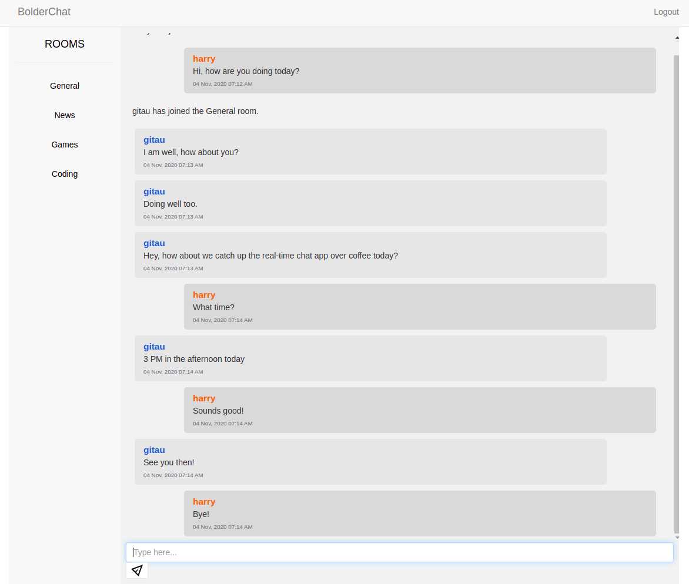

# Bolder Chat App

The full design of this real-time chat app can be found [here](https://www.figma.com/proto/IcpQGeCpSqsgPNZcXSd2x6/Bolder-Chat-App?node-id=1%3A2&scaling=min-zoom). I will follow this design to create it using Flask and SocketIO.

And this is how it looks like:



#### Overview

This is a real-time chat application built using `python` and `flask`. I have utilized websockets to facilitate real-time chat experience, and in particular, I have used the `flask-socketio` extension. 

#### Features

* User Authentication
* Functional Password Reset Feature
* Ability to post comments
* Realtime Date and Time
* Database Management
* Extra form protection
* Autofocus of the Chat Input Box
* Use of the Enter Key to Send Message
* Descent Automatic Chat Page Scrolldown
* Pre-created Rooms
* Immediate Addition of User in Default Room
* Chat Privacy in All Rooms

#### Tools Used
* Flask Framework
* Flask SocketIO
* Twitter Bootstrap for Cross-browser Responsiveness
* Python3 for Programming
* Javascript for Extra Page Interactivity
* SQLite for Local Development
* Python Datetime Module for Localtime Management
* Moment JS for Improved Time Formatting
* Google reCaptcha for Extra Form Security
* JQuery for Mobile Responsiveness
* Ngrok for Localhost Testing


#### Contributors:
* [Gitau Harrison](https://github.com/GitauHarrison)

#### Deployed Application
* [BoderChat App on Heroku](https://bolderchat-app.herokuapp.com/)

#### Testing

To test the project out, you can clone this repo to your local machine:

```python
$ git clone git@github.com:GitauHarrison/bolder-chat-app.git
```

Create and activate your virtual environment before running it:

```python
$ workon bolderchat_app # I am using virtualenv wrapper
```

Install all used dependancies:

```python
$ pip3 install -r requirements.txt
```
There are two ways you can run the application:
1. Using `flask run`:
```python
$ flask run
```
The `flask run` command introduced in Flask 0.11 can be used to start a Flask-SocketIO development server based on Werkzeug, but this method of starting the Flask-SocketIO server is not recommended due to lack of WebSocket support. 

2. Using the `chat.py` python script:
```python
$ python chat.py # it is a python script
```
The `socketio.run(app)` startup method is favoured to run WebSockets, hence the second way if recommended.

##### Localhost Testing

Once your application is running, you can access your localhost on http://127.0.0.1:5000/. Additionally, if you look carefully in your terminal, you will see `* Tunnel URL:  NgrokTunnel: "http://4209c9af6d43.ngrok.io" -> "http://localhost:5000"`

The `HTTP` value may be different from the one shown here because I am using the free tier package of `ngrok`. Paste the link http://4209c9af6d43.ngrok.io on another device, say your mobile phone, to test the application while it is on localhost.